# 1. Construct MongoDB:
 First of all, I created a database and collection via mongodb and imported the bookstore.json file into it.

 
 I created a **‘statefulset.yaml’** file. This file contains a StatefulSet configuration created to enable deployment and management of the **‘databaseproject’** in the Kubernetes environment. Contains information about the container and port.
 
 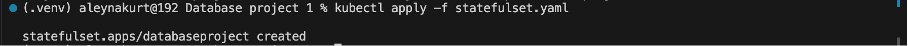

 The **‘mongodb-service.yaml’** file defines a Kubernetes service that makes a MongoDB service accessible in a Kubernetes cluster (ClusterIP). This service targets the **‘databaseproject’** and directs the pods running MongoDB to this service. 
This way, other pods or services can access Mongodb using this service.

 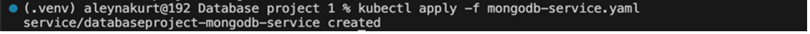

# 2. Develop Python Application:
In this step, I continued by installing flask and pymongo. Afterwards, I created an **‘app.py’** file. This Python script represents a RESTful API developed using Flask. It creates a bookstore application that interacts with the MongoDB database and performs basic **CRUD (Create, Read, Update, Delete)** operations.

After the app.py file is running, you can access it via this link.
**[Bookstore](http://127.0.0.1:50505/world/api/v1.0/bookstore)**

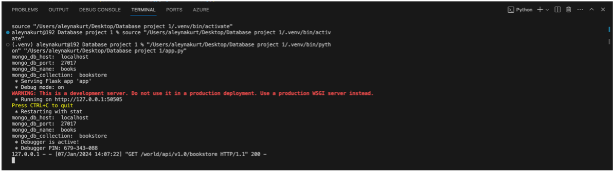

# POST:
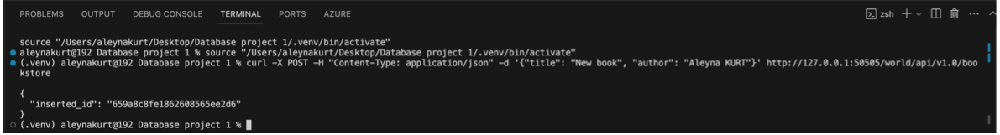
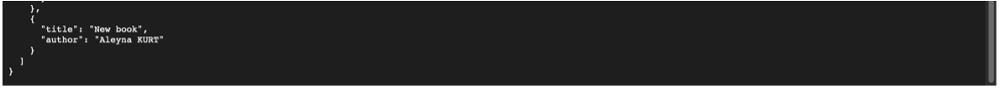

# PUT:
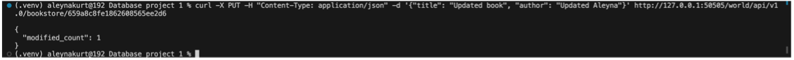
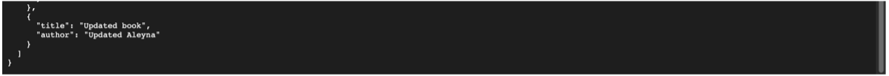

# DELETE:
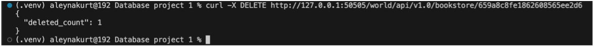

I created a **‘dockerfile’** to deploy the Python application into the Docker container. Here I also ensured that the requirements in the **‘requirements.txt’** I created were loaded. And I specified the port (50505).
After the dockerfile I created, I created the Docker image using this Dockerfile with the **‘docker build’** command and **‘run’** it with docker desktop. After creating the image, I ‘pushed’ it to the local image storage.

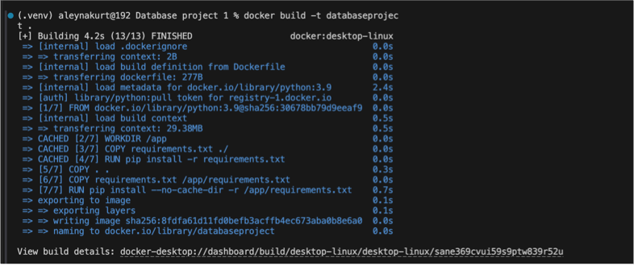

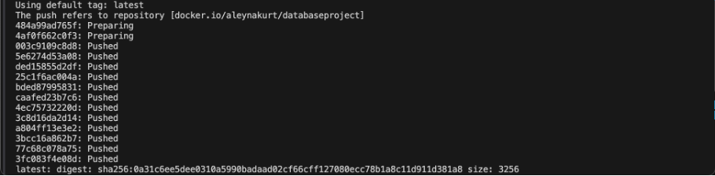

# 3. Kubernetes Deployment:
I created a **‘configmap.yaml’**. This file is used in the Kubernetes deployment file of the application called databaseproject, providing the connection information required to connect to MongoDB at the application's runtime. In this way, connection information can be updated according to changes in the application's Kubernetes environment.

In addition, I created **‘deployment.yaml’**. Here, a configuration is defined to run the application called **‘databaseproject’** as three replicas, and the MongoDB connection information that this application will use is obtained through configmap.yaml.

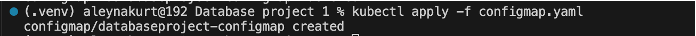
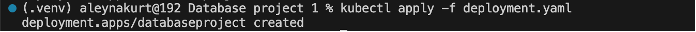

I checked by listing the pods running in the Kubernetes cluster to view the pods to verify that they were successfully deployed and running on Kubernetes.

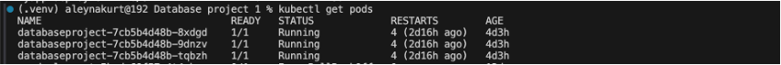

I checked by listing the services in the Kubernetes cluster. This is used to make applications and other resources accessible externally.

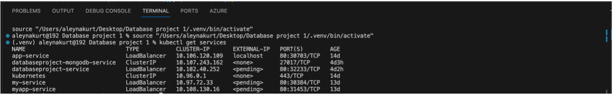

I used it to list deployments in a Kubernetes cluster. Deployments represent pods of applications and the configurations that manage those pods. A deployment ensures that your application is highly scalable and updatable.

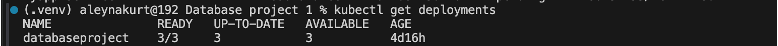

